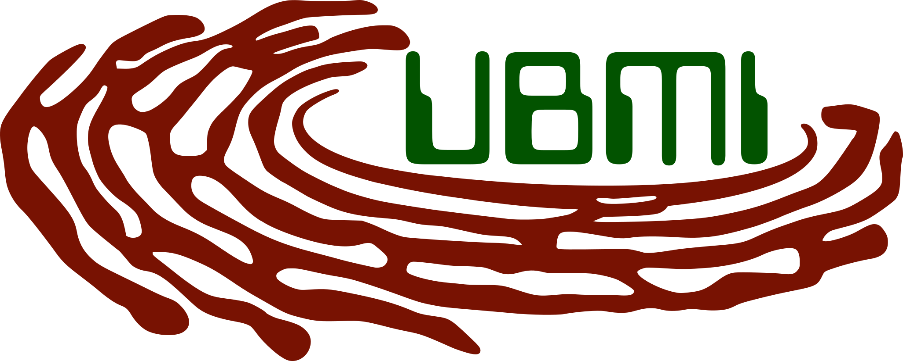

<div grid="~ cols-2 gap-60%" m="t--3" > 
<!-- Logo IFC -->

<!-- Logo UBMI -->

</div>

<br>

# Operaciones básicas con `conda` usando `miniforge`

## Unidad de Bioinformática y Manejo de la Información, IFC UNAM.

<br>

<a href="https://github.com/UBMI-IFC" target="_blank">
   <carbon:logo-github/>
</a>
<a href="mailto:ubmi@ifc.unam.mx" target="_blank">  <!-- class="slidev-icon-btn"> -->
   <carbon:email/>
</a>
<a href="https://sites.google.com/ifc.unam.mx/ubmi-ifc" target="_blank">  <!-- class="slidev-icon-btn"> -->
   <carbon:network-enterprise/>
</a>
<a href="https://www.youtube.com/@unidaddebioinformaticaifc5165" target="_blank">  <!-- class="slidev-icon-btn"> -->
   <carbon:logo-youtube/>
</a>

[Tutoriales UBMI-IFC](https://ubmi-ifc.github.io/Tutoriales-IFC)


<style>
code { 
  color: green; 
  background-color: #f0f0f0; 
  padding: 10px; 
  border: 1px solid #ccc;
  border-radius: 10px;
}

h1 {
  color: red;
  background-color: rgba(255, 192, 203, 0.2);
  border: 2px solid #ccc;
  border-radius: 10px; 
}
</style>


<!-- --- -->
<!-- transition: slide-left -->
<!-- --- -->


---
hideInToc: true
transition: slide-left
layout: two-cols
layoutClass: gap-15
---

# Navegación


|           Atajos de teclado                         |                             |
| --------------------------------------------------- | --------------------------- |
| <kbd>right</kbd> / <kbd>space</kbd>                 | Siguiente paso     |
| <kbd>left</kbd>  / <kbd>shift</kbd><kbd>space</kbd> | Paso anterior |
| <kbd>up</kbd>                                       | Siguiente diapositiva              |
| <kbd>down</kbd>                                     | Diapositiva anterior         |
| <kbd>f</kbd>                                        | _fullscreen_ |

<!-- https://sli.dev/guide/animations.html#click-animation -->

Pasa el _mouse_ por la esquina inferior izquierda para ver la barra de navegación.

<div class="demo-container">
  <svg class="absolute -bottom-28 -left-1 w-80 opacity-50">
    <polygon points="0,0 0,40 260,40 260,0" fill='#abcbca' stroke='#123123'
    stroke-width='2' fill-opacity="0.4" />
  </svg>
</div>

<p v-after class="absolute bottom--2 left-24 opacity-50 transform">Here!</p>

<!-- 
<!--   v-after -->
<!--   class="absolute -bottom-9 -left-7 w-80 opacity-50" -->
<!--   src="https://sli.dev/assets/arrow-bottom-left.svg" -->
<!--   alt="" -->
<!-- /> -->
<!-- <p v-after class="absolute bottom-23 left-45 opacity-30 transform -rotate-10">Here!</p> -->

::right::

# Tabla de contenido

Uso básico de `conda` con `miniforge` usando los canales
`conda-forge` y `bioconda`.


<Toc minDepth="1" maxDepth="1" />


<style>
h1 {
  background-color: #2B90B6;
  background-image: linear-gradient(45deg, #4EC5D4 10%, #146b8c 20%);
  background-size: 100%;
  -webkit-background-clip: text;
  -moz-background-clip: text;
  -webkit-text-fill-color: transparent;
  -moz-text-fill-color: transparent;
}
</style>


---
layout: intro
---


# ¿Qué es miniforge?

<br>

Es un remplazo de **Anaconda** que incluye `mamba` cómo **gestor de paquetes** alternativo y usa el
canal (*channel*) **conda-forge** como repositorio de *software* principal.

<br>
<br>


Consulta su <span v-mark.circle.orange>[perfil de GitHub](https://github.com/conda-forge/miniforge)</span> para encontrar las indicaciones de descarga.


<style>
h1 {
  background-color: #2B90B6;
  background-image: linear-gradient(45deg, #4EC5D4 10%, #146b8c 20%);
  background-size: 100%;
  -webkit-background-clip: text;
  -moz-background-clip: text;
  -webkit-text-fill-color: transparent;
  -moz-text-fill-color: transparent;
}
</style>


<!--
Here is another comment.
-->

---

# Buscar programas

Es importante verificar que el canal de donde se descarga el programa sea diferente
a `default`.


````md magic-move 
```bash 
(base)$ conda search tensorflow 
```
```text {2-}
(base)$ conda search tensorflow 

...

Loading channels: done
# Name                       Version           Build  Channel
tensorflow                     0.8.0          py27_0  conda-forge
tensorflow                     0.9.0          py34_0  conda-forge
tensorflow                    0.10.0          py27_0  conda-forge
tensorflow                    0.10.0          py34_0  conda-forge
tensorflow                 0.11.0rc0          py34_0  conda-forge
tensorflow                 0.11.0rc0          py35_0  conda-forge
```
````


<Arrow v-click x1="400" y1="450" x2="480" y2="380" color="salmon"/>

<p v-after class="absolute bottom-13 left-80 opacity-100 color-red "  >¡Canal<code>conda-forge</code>!</p>


<style>

h1 {
  background-color: #2B90B6;
  background-image: linear-gradient(45deg, #4EC5D4 10%, #146b8c 20%);
  background-size: 100%;
  -webkit-background-clip: text;
  -moz-background-clip: text;
  -webkit-text-fill-color: transparent;
  -moz-text-fill-color: transparent;
}
</style>


---
layout: default
---

# Buscar programas en bioconda

Se pueden buscar paquetes en otros canales de la comunidad como `bioconda`.

````md magic-move
```bash
(base)$ conda search -c bioconda samtools
```

```text {2-}
(base)$ conda search -c bioconda samtools

...

 Loading channels: done
# Name                       Version           Build  Channel
samtools                      1.19.1      h50ea8bc_0  bioconda
samtools                      1.19.2      h50ea8bc_1  bioconda
samtools                        1.20      h50ea8bc_0  bioconda
samtools                        1.21      h50ea8bc_0  bioconda
samtools                        1.21      h96c455f_1  bioconda
```
````

<!-- <div v-click class='text-xl'> El canal `bioconda` es un repositorio de programas enfocados a bioinformática y biología computacional.  -->
<!-- </div> -->


<div v-after
  v-motion
  :initial="{ x: -80 }"
  :enter="{ x: 0 }"
  :leave="{ x: 80 }"
>
  El canal <code>bioconda</code> es un repositorio de programas enfocados a bioinformática y biología computacional.
  Por ejemplo:
  <ul>
  <li>bowtie2</li>
  <li>blast+</li>
  <li>entre muchos otros.</li>
</ul>
</div>

<style>

h1 {
  background-color: #2B90B6;
  background-image: linear-gradient(45deg, #4EC5D4 10%, #146b8c 20%);
  background-size: 100%;
  -webkit-background-clip: text;
  -moz-background-clip: text;
  -webkit-text-fill-color: transparent;
  -moz-text-fill-color: transparent;
}
</style>


---
layout: default
---

# Instalación de programas

<br/>

##### Instalar programas con el repositorio por omisión, `conda-forge`.

```bash
(base)$ conda install tensorflow
```
<br/>


<div v-click
  v-motion
  :initial="{ x: -80 }"
  :enter="{ x: 0 }"
  :leave="{ x: 80 }"
>
Buscar programas <b>solo</b> con <code>bioconda</code>.
  
```bash
(base)$ conda install -c bioconda -c conda-forge bowtie2
```

</div>
<br/>

<div v-click
  v-motion
  :initial="{ x: -80 }"
  :enter="{ x: 0 }"
  :leave="{ x: 80 }"
>
Algunos programas de <code>bioconda</code> necesitan dependencias que están en <code>conda-forge</code>.

<small><i>Por esta razón es recomendable siempre usar ambos canales para instalar programas.</i></small>
  
```bash
(base)$ conda install -c bioconda -c conda-forge bowtie2
```
</div>

<style>
h1 {
  background-color: #2B90B6;
  background-image: linear-gradient(45deg, #4EC5D4 10%, #146b8c 20%);
  background-size: 100%;
  -webkit-background-clip: text;
  -moz-background-clip: text;
  -webkit-text-fill-color: transparent;
  -moz-text-fill-color: transparent;
}
</style>


---


# Creación de ambientes virtuales.  

Para usar un ambiente virtual se tienen que seguir los siguientes pasos:

<v-click at="1"><h5>1. Crear el ambiente virtual con los programas deseados.</h5></v-click>

<v-click at="2"><h5>2. Activar el ambiente virtual.</h5></v-click>

<v-click at="4"><h5>3. Ejecutar el programa deseado.</h5></v-click>
    

````md magic-move 
```bash
(base)$ conda create -n samtools-env -c conda-forge -c bioconda  samtools
```
```text {2-}
(base)$ conda create -n samtools-env -c conda-forge -c bioconda  samtools
...
reparing transaction: done
Verifying transaction: done
Executing transaction: done
#
# To activate this environment, use
#
#     $ conda activate samtools-env
#
# To deactivate an active environment, use
#
#     $ conda deactivate
```
```bash {15}
(base)$ conda create -n samtools-env -c conda-forge -c bioconda  samtools
...
reparing transaction: done
Verifying transaction: done
Executing transaction: done
#
# To activate this environment, use
#
#     $ conda activate samtools-env
#
# To deactivate an active environment, use
#
#     $ conda deactivate

(base)$ conda activate samtools-env
```
```bash
(samtools-env)$ samtools -h
```
```text {2-}
(samtools-env)$ samtools -h

Program: samtools (Tools for alignments in the SAM format)
Version: 1.21 (using htslib 1.21)

Usage:   samtools <command> [options]

Commands:
  -- Indexing
     dict           create a sequence dictionary file
     faidx          index/extract FASTA
     fqidx          index/extract FASTQ
     index          index alignment
```
````
<div v-after
  v-motion
  :initial="{ x: -80 }"
  :enter="{ x: 0 }"
  :leave="{ x: 80 }"
>

El programa instalado sólo es funcional cuando se activa el ambiente virtual.
  
</div>

<style>
h1 {
  background-color: #2B90B6;
  background-image: linear-gradient(45deg, #4EC5D4 10%, #146b8c 20%);
  background-size: 100%;
  -webkit-background-clip: text;
  -moz-background-clip: text;
  -webkit-text-fill-color: transparent;
  -moz-text-fill-color: transparent;
}
</style>

---
layout: center
hideInToc: true
---

# Creación de ambientes virtuales.

Los ambientes virtuales también te permiten juntar todas las dependencias necesarias para hacer programas
con aplicaciones específicas. Incluso, puedes especificar versiones concretas.

```bash
(base)$ conda create -n miambiente -c conda-forge -c bioconda \
              python=3.4 scipy numpy=1.3 seaborn jupyterlab
```

<div v-click
  v-motion
  :initial="{ x: -80 }"
  :enter="{ x: 0 }"
  :leave="{ x: 80 }"
>
Es recomendable instalar todas las dependencias necesarias desde el momento de creación del ambiente virtual.  
</div>


<style>
h1 {
  background-color: #2B90B6;
  background-image: linear-gradient(45deg, #4EC5D4 10%, #146b8c 20%);
  background-size: 100%;
  -webkit-background-clip: text;
  -moz-background-clip: text;
  -webkit-text-fill-color: transparent;
  -moz-text-fill-color: transparent;
}
</style>


---
layout: two-cols-header
layoutClass: gap-12
hideInToc: true
---

# Creación de ambientes virtuales

Se puede instalar paquetes de otros repositorios dentro de un ambiente virtual ya creado.
Esto ayuda a complementar los canales `conda-forge` o `bioconda`.

<div v-click
  v-motion
  :initial="{ x: -80 }"
  :enter="{ x: 0 }"
  :leave="{ x: 80 }"
>
Es recomendable instalar todas las dependencias necesarias desde el momento de creación del ambiente virtual.  
</div>


::left::

## Python

````md magic-move
```bash
(base)$ conda create -n myenv -c conda-forge python=3.11
```
```bash {3}
(base)$ conda create -n myenv -c conda-forge python=3.11

(base)$ conda activate myenv
```
```bash {5}
(base)$ conda create -n myenv -c conda-forge python=3.11

(base)$ conda activate myenv

(myenv)$ pip install tensorflow polars seaborn
```
````

::right::

## R

````md magic-move
```bash
(base)$ conda create -n myRenv -c conda-forge r=4
```
```bash {3}
(base)$ conda create -n myRenv -c conda-forge r=4

(base)$ conda activate myRenv
```
```bash {5}
(base)$ conda create -n myRenv -c conda-forge r=4

(base)$ conda activate myRenv

(myRenv)$ R
```
```r
> install.packages(c('readr', 'ggplot2', 'tidyr'))
```
````

<style>
h1 {
  background-color: #2B90B6;
  background-image: linear-gradient(45deg, #4EC5D4 10%, #146b8c 20%);
  background-size: 100%;
  -webkit-background-clip: text;
  -moz-background-clip: text;
  -webkit-text-fill-color: transparent;
  -moz-text-fill-color: transparent;
}
</style>


---

# Algunos comandos útiles


<v-clicks>

1. ¿Cómo actualziar un ambiente virtual?
```bash
# Ambiente base
(base)$ conda update --all
# Otro ambiente por nombre
(base)$ conda update -n miambiente --all
```

2. ¿Cómo enlistar los paquetes, programas o bibliotecas instaladas en un ambiente?
```bash
# Ambiente base
(base)$ conda list
# Otros ambientes desde el ambiente base
(base)$ conda list -n miambiente
```

3. ¿Como borrar un ambiente virtual?
```bash
(base)$ conda remove -n miambiente --all
```

4. ¿Cómo borrar programas?
```bash
(base)$ conda remove polars
```
</v-clicks>


<style>
h1 {
  background-color: #2B90B6;
  background-image: linear-gradient(45deg, #4EC5D4 10%, #146b8c 20%);
  background-size: 100%;
  -webkit-background-clip: text;
  -moz-background-clip: text;
  -webkit-text-fill-color: transparent;
  -moz-text-fill-color: transparent;
}
</style>


---
layout: end
---

# ¿Tienes más dudas?

Contáctanos:

[ubmi@ifc.unam.mx](mailto:ubmi@ifc.unam.mx)

<!-- [GitHub](https://github.com/slidevjs/slidev) · [Showcases](https://sli.dev/resources/showcases) -->


<PoweredBySlidev mt-10 />

<footer class="absolute bottom-5 left-93% right-0 p-2"> <Link to="2"><div class="i-carbon:home" /></Link>  </footer>

